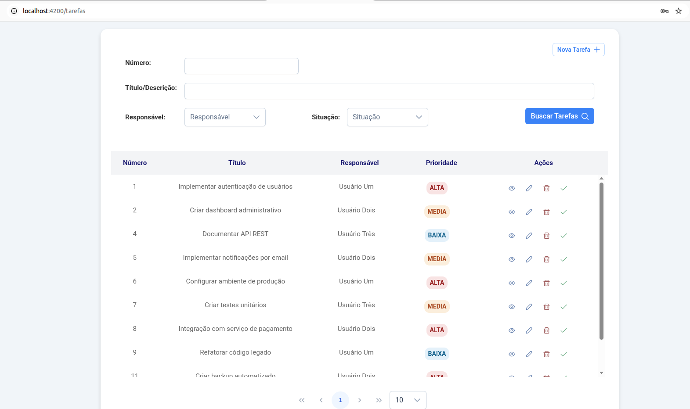
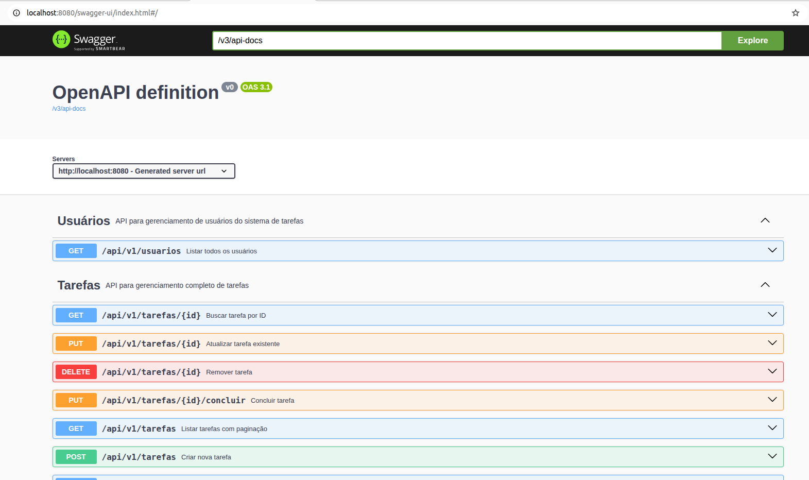
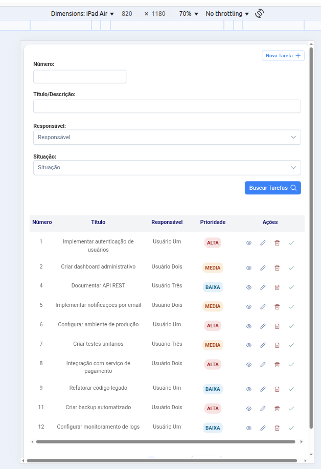
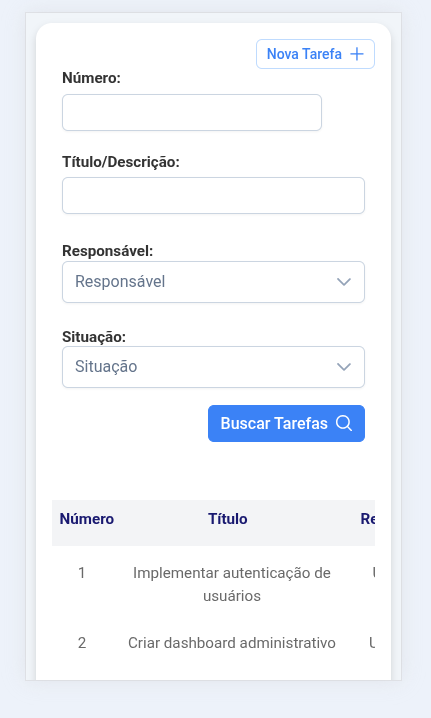

# Gerenciador de Tarefas - Orientações de Implementação

## Visão Geral do Projeto

Este projeto implementa um sistema completo de gerenciamento de tarefas com arquitetura de microserviços, composto por um frontend em Angular e um backend em Spring Boot, utilizando PostgreSQL como banco de dados.

  

## Itens Implementados

###  a) Frontend em Angular (Versão Mais Recente)
- **Versão**: Angular 20.1.0
- **Framework UI**: PrimeNG 20.0.1 com PrimeFlex 4.0.0
- **Tema**: Customizado com suporte a temas responsivos
- **Arquitetura**: Feature-based com separação clara de responsabilidades

###  b) Backend em Java 21 e Spring Boot 3
- **Java**: Versão 21
- **Spring Boot**: Versão 3.5.4
- **Arquitetura**: Clean Architecture com separação em camadas (Domain, Application, Infrastructure, Presentation)

###  c) Persistência PostgreSQL com JPA
- **Banco**: PostgreSQL 16.8
- **ORM**: Spring Data JPA com Hibernate
- **Migração**: Liquibase para controle de versão do banco
- **Cache**: Implementação de cache com Spring Cache

###  d) Endpoints REST
- **Padrão**: RESTful API com versionamento (/api/v1/)
- **Autenticação**: JWT (JSON Web Tokens)
- **Segurança**: Spring Security com CORS configurado
- **Validação**: Bean Validation com tratamento global de exceções

## Detalhes Técnicos da Implementação

## Backend

#### Arquitetura e Estrutura


```
backend/src/main/java/group/esig/todo/
├── domain/ # Entidades e regras de negócio
├── application/ # Casos de uso e DTOs
├── infrastructure/ # Configurações, repositórios e segurança
└── presentation/ # Controllers e tratamento de exceções
```


#### Tecnologias Utilizadas
- **Spring Boot 3.5.4**: Framework principal
- **Spring Security**: Autenticação e autorização
- **Spring Data JPA**: Persistência de dados
- **Liquibase**: Controle de migração do banco
- **MapStruct**: Mapeamento entre objetos
- **Lombok**: Redução de boilerplate
- **JWT**: Autenticação stateless
- **PostgreSQL**: Banco de dados principal
- **H2**: Banco de dados para testes

#### Endpoints REST Implementados

**Autenticação:**
- `POST /api/v1/auth/login` - Login de usuário

**Tarefas:**
- `GET /api/v1/tarefas` - Listar tarefas com paginação
- `GET /api/v1/tarefas/{id}` - Buscar tarefa por ID
- `POST /api/v1/tarefas` - Criar nova tarefa
- `PUT /api/v1/tarefas/{id}` - Atualizar tarefa
- `DELETE /api/v1/tarefas/{id}` - Excluir tarefa
- `PUT /api/v1/tarefas/{id}/concluir` - Marcar tarefa como concluída
- `GET /api/v1/tarefas/busca` - Busca avançada com filtros

**Usuários:**
- `GET /api/v1/usuarios` - Listar todos os usuários

#### Documentação da API - Swagger
- **URL**: http://localhost:8080/swagger-ui/index.html
- **Descrição**: Interface interativa para documentação completa da API REST
- **Funcionalidades**:
  - Visualização de todos os endpoints disponíveis
  - Teste direto dos endpoints com parâmetros
  - Exemplos de requisições e respostas

  

#### Segurança
- **JWT Authentication**: Tokens com expiração configurável
- **CORS**: Configurado para permitir comunicação com frontend
- **BCrypt**: Hash de senhas

#### Banco de Dados
- **PostgreSQL 16.8**: Banco principal
- **Liquibase**: Controle de versão do schema
- **JPA/Hibernate**: ORM com configuração otimizada

## Frontend

#### Arquitetura e Estrutura

```
frontend/src/app/
├── core/ # Serviços, modelos e interceptors
├── features/ # Módulos funcionais (auth, todo)
├── shared/ # Componentes e tipos compartilhados
└── app.* # Configuração principal
```

#### Tecnologias Utilizadas
- **Angular 20.1.0**: Framework principal
- **PrimeNG 20.0.1**: Biblioteca de componentes UI
- **PrimeFlex 4.0.0**: Sistema de grid e utilitários CSS
- **RxJS**: Programação reativa
- **TypeScript**: Tipagem estática
- **Angular Forms**: Formulários reativos

#### Funcionalidades Implementadas
- **Autenticação**: Login com JWT e guard de rotas
- **CRUD de Tarefas**: Criação, edição, exclusão e visualização
- **Filtros Avançados**: Busca por ID, termo, prioridade, responsável e situação
- **Paginação**: Sistema de paginação com PrimeNG
- **Responsividade**: Interface adaptável a diferentes dispositivos
- **Interceptors**: Interceptor para adicionar token JWT automaticamente

#### Componentes Principais
- **LoginPage**: Tela de autenticação
- **ListaTarefasPage**: Página principal com grid de tarefas
- **TarefaCadastro**: Modal para criação de tarefas
- **TarefaEdicao**: Modal para edição de tarefas
- **TarefaExclusao**: Confirmação de exclusão
- **ListaTarefasGrid**: Grid responsivo com ações
- **ListaTarefasCampos**: Filtros de busca

#### Responsividade e Adaptação a Diferentes Tamanhos de Tela
- **Mobile First**: Design baseado em abordagem mobile-first para garantir boa experiência em dispositivos móveis
- **Breakpoints Responsivos**: Utilização do sistema de grid do PrimeFlex com breakpoints para:
  - **Mobile**: < 768px - Layout em coluna única, botões empilhados
  - **Tablet**: 768px - 1024px - Grid de 2 colunas, filtros em linha
  - **Desktop**: > 1024px - Grid completo com todas as funcionalidades
- **Componentes Adaptativos**: 
  - Grid de tarefas se adapta automaticamente ao tamanho da tela
  - Modais responsivos que se ajustam à viewport
  - Formulários com layout flexível





## Instruções para Execução com Docker

1. **Clone o repositório:**
```bash
git clone https://github.com/adyssonferreira/GerenciadorDeTarefas_ESIG.git
cd gerenciador-tarefas
```

2. **Execute com Docker Compose:**
```bash
docker-compose up -d
```

3. **Acesse a aplicação:**
- Frontend: http://localhost
- Backend: http://localhost:8080
- PostgreSQL: localhost:5432

### Configurações de Ambiente

### Dados de Teste
O sistema inclui dados de teste pré-configurados:
- **Usuário padrão**: `usuario1@exemplo.com`
- **Senha**: *123*

### Possíveis melhorias
- Implementação de maior cobertura testes automatizados
- CI/CD pipeline
- Monitoramento e logs
- Backup automático do banco